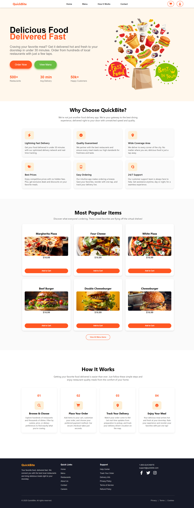

# Fast Food Delivery Demo Website

This is a demo website for a fast food delivery service built using modern web technologies.

## Features

- **User Types:**  
  - **Customers:** Can browse the menu and select items to order.  
  - **Restaurant Users:** Can manage and modify their menu items.

- **Frontend:**  
  Built with **React**, **JSX**, **HTML**, and **CSS** for a responsive and interactive user interface.

- **Backend:**  
  Powered by **MongoDB** to manage user data and restaurant menus.

## Technologies Used

- React  
- HTML & CSS  
- JSX  
- MongoDB

## How it Works

- Customers can browse menus, select items, and place orders.  
- Restaurant users can log in and update their menu items dynamically.

## 📸 Image Credits

- Image used in this project by [Muteeb Mehraj](https://www.figma.com/community/file/1082654572769267744) (via Figma), licensed under [CC BY 4.0](https://creativecommons.org/licenses/by/4.0/). Modified for this project.

- Images marked as Free from Freepik are **Designed by Freepik** and sourced from [www.freepik.com](https://www.freepik.com).

